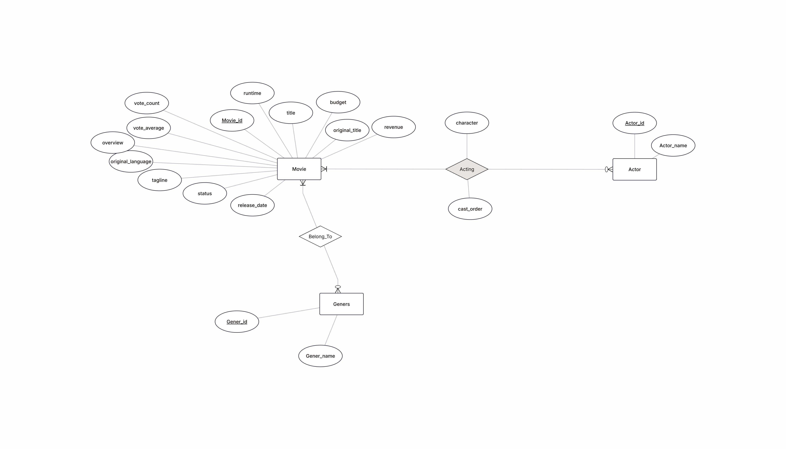
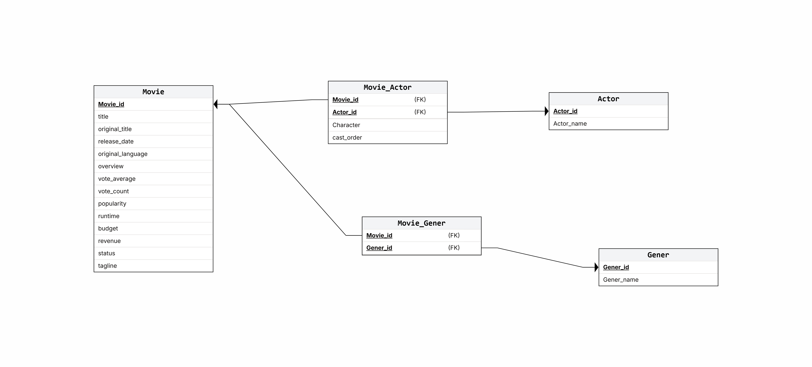

# Movie Data Pipeline

An end-to-end Data Engineering project that collects movie data from the TMDB API, stores the raw data in MongoDB, transforms and validates it using Python and Pandas, loads it into a SQL Server data warehouse, and performs analytical queries and visualizations.

## Project Architecture

```text
TMDB API
    ↓
Python Extraction
    ↓
MongoDB
    ↓
Pandas ETL
    ↓
Data Validation
    ↓
SQL Server
    ↓
SQL Analysis
    ↓
Visualization
```

## Technologies

* Python
* TMDB API
* MongoDB
* Pandas
* PyMongo
* PyODBC
* Microsoft SQL Server
* Matplotlib
* Git & GitHub

## Data Pipeline

### 1. Data Extraction

Movie data is collected from the TMDB API.

For each movie, the pipeline retrieves:

* Movie details
* Ratings
* Vote counts
* Popularity
* Runtime
* Budget
* Revenue
* Genres
* Cast information
* Actor IDs

The current dataset contains 100 movies collected from 5 TMDB pages.

### 2. Raw Data Storage

The extracted data is stored in MongoDB before transformation.

Database:

```text
movie_data
```

Collection:

```text
movies_raw
```

The raw layer keeps the original nested movie and cast information so the transformation process can work from a stored source dataset.

### 3. ETL and Transformation

Python and Pandas are used to transform the nested MongoDB documents into relational datasets.

The transformation creates:

* Movies
* Actors
* Genres
* Movie_Actors
* Movie_Genres

The ETL process also handles:

* Date conversion
* Nested JSON normalization
* Genre extraction
* Actor extraction
* Many-to-many relationships
* Duplicate removal
* Data validation

### 4. Data Validation

The pipeline validates the transformed data before loading it into SQL Server.

Validation checks include:

* Missing values
* Invalid release dates
* Invalid ratings
* Negative vote counts
* Negative popularity
* Negative runtime
* Negative budget
* Negative revenue
* Duplicate movie IDs
* Invalid foreign key relationships
* Invalid genre IDs
* Invalid actor IDs

All validation checks passed successfully for the current dataset.

## Data Warehouse

The transformed data is stored in a SQL Server database:

```text
MovieDataWarehouse
```

### Database Design

#### Entity Relationship Diagram



#### Relational Mapping



### Database Schema

```text
Movies
    │
    ├──────── Movie_Actors ──────── Actors
    │
    └──────── Movie_Genres ──────── Genres
```

### Tables

#### Movies

Stores the main movie information.

```text
movie_id
title
original_title
release_date
original_language
overview
vote_average
vote_count
popularity
runtime
budget
revenue
status
tagline
```

#### Actors

Stores unique actors.

```text
actor_id
actor_name
```

#### Genres

Stores unique movie genres.

```text
genre_id
genre_name
```

#### Movie_Actors

Junction table representing the many-to-many relationship between movies and actors.

```text
movie_id
actor_id
character
cast_order
```

#### Movie_Genres

Junction table representing the many-to-many relationship between movies and genres.

```text
movie_id
genre_id
```

## Current Dataset

| Dataset                   | Records |
| ------------------------- | ------: |
| Movies                    |     100 |
| Actors                    |   3,948 |
| Genres                    |      17 |
| Movie-Actor Relationships |   4,320 |
| Movie-Genre Relationships |     264 |

## Analysis

SQL Server is used to answer analytical questions about the dataset.

The current analysis includes:

* Highest-rated movies
* Most-voted movies
* Most popular movies
* Number of movies per genre
* Average rating by genre
* Actors with the most movie appearances
* Highest-revenue movies
* Budget vs. revenue

## Visualization

The project includes visualizations created with Matplotlib:

* Number of movies per genre
* Average movie rating by genre
* Top 10 actors by movie count
* Top 10 movies by revenue
* Budget vs. revenue

## Project Structure

```text
MovieData-Pipeline/
│
├── .env
├── .gitignore
├── requirements.txt
├── README.md
├── MovieERD.png
├── MovieMapping.png
│
└── src/
    ├── __init__.py
    │
    ├── tmdb_api.py
    ├── mongo.py
    ├── extract.py
    │
    ├── load_from_mongo.py
    ├── transform_movies.py
    │
    ├── test_sql_connection.py
    ├── create_database.py
    ├── create_tables.py
    ├── load_to_sql.py
    │
    ├── analysis.py
    └── visualization.py
```

## How to Run

### 1. Clone the repository

```bash
git clone <repository-url>
cd MovieData-Pipeline
```

### 2. Create a virtual environment

```bash
python -m venv .venv
```

Activate it on Windows:

```powershell
.venv\Scripts\activate
```

### 3. Install dependencies

```bash
pip install -r requirements.txt
```

### 4. Configure environment variables

Create a `.env` file in the project root:

```env
TMDB_ACCESS_TOKEN=your_access_token
TMDB_API_KEY=your_api_key
```

### 5. Start MongoDB

Make sure the local MongoDB service is running.

The project uses:

```text
mongodb://localhost:27017
```

### 6. Extract and store raw data

```bash
python src/extract.py
```

### 7. Create the SQL Server database

```bash
python src/create_database.py
```

### 8. Create the SQL tables

```bash
python src/create_tables.py
```

### 9. Load the transformed data into SQL Server

```bash
python src/load_to_sql.py
```

### 10. Run the analysis

```bash
python src/analysis.py
```

### 11. Generate visualizations

```bash
python src/visualization.py
```

## Data Engineering Concepts Demonstrated

This project demonstrates several practical Data Engineering concepts:

* REST API data extraction
* API authentication
* Raw data storage
* MongoDB
* ETL pipelines
* JSON normalization
* Pandas transformations
* Data validation
* Relational data modeling
* Many-to-many relationships
* SQL Server
* Primary and foreign keys
* Batch data loading
* Analytical SQL
* Data visualization

## Project Outcome

The project implements a complete data pipeline from an external API to a structured SQL Server data warehouse, with a raw MongoDB layer, automated transformations, validation, analytical queries, and visualizations.

It demonstrates how semi-structured API data can be collected, stored, transformed, validated, modeled, and analyzed as part of an end-to-end Data Engineering workflow.
